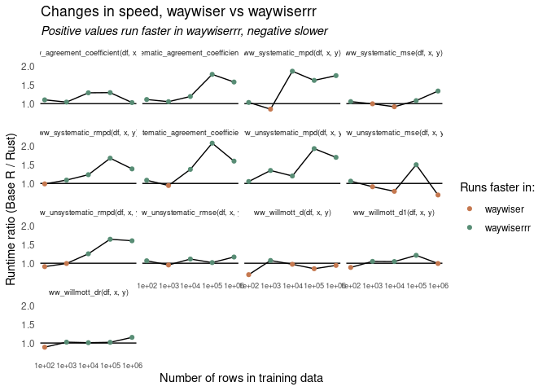

<!-- README.md is generated from README.Rmd. Please edit that file -->

# waywiserrr <a href="https://docs.ropensci.org/waywiser/"></a>

waywiserrr is [waywise**r**](https://docs.ropensci.org/waywiser/),
**r**ewritten in **R**ust. I’m using this repo to experiment with using
Rust in R packages, and to try and muddle my way through learning
ndarray.

You probably shouldn’t use this; this repo forked from waywiser a while
back, with most bug fixes and feature additions put into the main repo.
I’m also not particularly likely to port any of this code into the main
repo, as the speedups don’t yet justify the headache of maintaining a
package with compiled code (or, in particular, maintaining a package
with Rust code).

## Comparisons

``` r
benchmarks <- bench::press(
  rows = 10^(2:6),
  {
    df <- withr::with_seed(
      1107,
      data.frame(x = rnorm(rows), y = rnorm(rows))
    )
    bench::mark(
      waywiser::ww_agreement_coefficient(df, x, y),
      waywiserrr::ww_agreement_coefficient(df, x, y),
      waywiser::ww_systematic_agreement_coefficient(df, x, y),
      waywiserrr::ww_systematic_agreement_coefficient(df, x, y),
      waywiser::ww_unsystematic_agreement_coefficient(df, x, y),
      waywiserrr::ww_unsystematic_agreement_coefficient(df, x, y),
      waywiser::ww_unsystematic_mpd(df, x, y),
      waywiserrr::ww_unsystematic_mpd(df, x, y),
      waywiser::ww_systematic_mpd(df, x, y),
      waywiserrr::ww_systematic_mpd(df, x, y),
      waywiser::ww_unsystematic_rmpd(df, x, y),
      waywiserrr::ww_unsystematic_rmpd(df, x, y),
      waywiser::ww_systematic_rmpd(df, x, y),
      waywiserrr::ww_systematic_rmpd(df, x, y),
      waywiser::ww_willmott_d(df, x, y),
      waywiserrr::ww_willmott_d(df, x, y),
      waywiser::ww_willmott_d1(df, x, y),
      waywiserrr::ww_willmott_d1(df, x, y),
      waywiser::ww_willmott_dr(df, x, y),
      waywiserrr::ww_willmott_dr(df, x, y),
      waywiser::ww_systematic_mse(df, x, y),
      waywiserrr::ww_systematic_mse(df, x, y),
      waywiser::ww_unsystematic_mse(df, x, y),
      waywiserrr::ww_unsystematic_mse(df, x, y),
      waywiser::ww_unsystematic_rmse(df, x, y),
      waywiserrr::ww_unsystematic_rmse(df, x, y),
      check = FALSE,
      min_iterations = 10,
      filter_gc = FALSE
    )
  }
)

library(ggplot2)
benchmarks |> 
  dplyr::mutate(
    expression = as.character(expression),
    median = as.numeric(median)
  ) |> 
  tidyr::separate_wider_delim(
    "expression", "::", names = c("package", "func")
  ) |> 
  dplyr::arrange(rows, func, package) |> 
  dplyr::group_by(rows, func) |> 
  dplyr::summarise(
    ratio = median[1] / median[2],
    .groups = "drop"
  ) |> 
  ggplot() +
  aes(x = rows, y = ratio) + 
  geom_abline(slope = 0, intercept = 1, linesize = 0.2) +
  geom_line(linewidth = .5) +
  geom_point(aes(color = ratio > 1)) +
  scale_x_log10() +
  scale_color_manual(
    "Runs faster in:",
    labels = c("waywiser", "waywiserrr"),
    values = c("#c5784f", "#588d75")
  ) +
  labs(
    x = "Number of rows in training data",
    y = "Runtime ratio (Base R / Rust)",
    title = "Changes in speed, waywiser vs waywiserrr",
    subtitle = "Positive values run faster in waywiserrr, negative slower"
  ) +
  theme_minimal() +
  theme(
    plot.subtitle = element_text(face = "italic"),
    panel.grid = element_blank(),
    strip.text = element_text(size = 7),
    axis.text.x = element_text(size = 7)
  ) +
  facet_wrap(~ func)
```



``` r

print(
  benchmarks[c("expression", "rows", "median")],
  n = 999
)
#> # A tibble: 130 × 3
#>     expression                                                     rows   median
#>     <bch:expr>                                                    <dbl> <bch:tm>
#>   1 waywiser::ww_agreement_coefficient(df, x, y)                    100    1.3ms
#>   2 waywiserrr::ww_agreement_coefficient(df, x, y)                  100    1.3ms
#>   3 waywiser::ww_systematic_agreement_coefficient(df, x, y)         100   1.36ms
#>   4 waywiserrr::ww_systematic_agreement_coefficient(df, x, y)       100   1.33ms
#>   5 waywiser::ww_unsystematic_agreement_coefficient(df, x, y)       100   1.37ms
#>   6 waywiserrr::ww_unsystematic_agreement_coefficient(df, x, y)     100   1.32ms
#>   7 waywiser::ww_unsystematic_mpd(df, x, y)                         100   1.35ms
#>   8 waywiserrr::ww_unsystematic_mpd(df, x, y)                       100   1.33ms
#>   9 waywiser::ww_systematic_mpd(df, x, y)                           100   1.37ms
#>  10 waywiserrr::ww_systematic_mpd(df, x, y)                         100   1.32ms
#>  11 waywiser::ww_unsystematic_rmpd(df, x, y)                        100   1.34ms
#>  12 waywiserrr::ww_unsystematic_rmpd(df, x, y)                      100    1.3ms
#>  13 waywiser::ww_systematic_rmpd(df, x, y)                          100   1.33ms
#>  14 waywiserrr::ww_systematic_rmpd(df, x, y)                        100   1.31ms
#>  15 waywiser::ww_willmott_d(df, x, y)                               100   1.29ms
#>  16 waywiserrr::ww_willmott_d(df, x, y)                             100    1.3ms
#>  17 waywiser::ww_willmott_d1(df, x, y)                              100   1.26ms
#>  18 waywiserrr::ww_willmott_d1(df, x, y)                            100   1.28ms
#>  19 waywiser::ww_willmott_dr(df, x, y)                              100   1.26ms
#>  20 waywiserrr::ww_willmott_dr(df, x, y)                            100   1.22ms
#>  21 waywiser::ww_systematic_mse(df, x, y)                           100   2.03ms
#>  22 waywiserrr::ww_systematic_mse(df, x, y)                         100   1.96ms
#>  23 waywiser::ww_unsystematic_mse(df, x, y)                         100   1.88ms
#>  24 waywiserrr::ww_unsystematic_mse(df, x, y)                       100   1.91ms
#>  25 waywiser::ww_unsystematic_rmse(df, x, y)                        100   1.94ms
#>  26 waywiserrr::ww_unsystematic_rmse(df, x, y)                      100    1.9ms
#>  27 waywiser::ww_agreement_coefficient(df, x, y)                   1000   1.26ms
#>  28 waywiserrr::ww_agreement_coefficient(df, x, y)                 1000   1.27ms
#>  29 waywiser::ww_systematic_agreement_coefficient(df, x, y)        1000   1.41ms
#>  30 waywiserrr::ww_systematic_agreement_coefficient(df, x, y)      1000   1.33ms
#>  31 waywiser::ww_unsystematic_agreement_coefficient(df, x, y)      1000   1.36ms
#>  32 waywiserrr::ww_unsystematic_agreement_coefficient(df, x, y)    1000   1.36ms
#>  33 waywiser::ww_unsystematic_mpd(df, x, y)                        1000   1.34ms
#>  34 waywiserrr::ww_unsystematic_mpd(df, x, y)                      1000    1.3ms
#>  35 waywiser::ww_systematic_mpd(df, x, y)                          1000   1.36ms
#>  36 waywiserrr::ww_systematic_mpd(df, x, y)                        1000   1.31ms
#>  37 waywiser::ww_unsystematic_rmpd(df, x, y)                       1000   1.44ms
#>  38 waywiserrr::ww_unsystematic_rmpd(df, x, y)                     1000   1.31ms
#>  39 waywiser::ww_systematic_rmpd(df, x, y)                         1000   1.39ms
#>  40 waywiserrr::ww_systematic_rmpd(df, x, y)                       1000   1.31ms
#>  41 waywiser::ww_willmott_d(df, x, y)                              1000   1.24ms
#>  42 waywiserrr::ww_willmott_d(df, x, y)                            1000   1.25ms
#>  43 waywiser::ww_willmott_d1(df, x, y)                             1000   1.25ms
#>  44 waywiserrr::ww_willmott_d1(df, x, y)                           1000   1.32ms
#>  45 waywiser::ww_willmott_dr(df, x, y)                             1000   1.24ms
#>  46 waywiserrr::ww_willmott_dr(df, x, y)                           1000   1.24ms
#>  47 waywiser::ww_systematic_mse(df, x, y)                          1000   1.95ms
#>  48 waywiserrr::ww_systematic_mse(df, x, y)                        1000   1.94ms
#>  49 waywiser::ww_unsystematic_mse(df, x, y)                        1000   1.97ms
#>  50 waywiserrr::ww_unsystematic_mse(df, x, y)                      1000   2.01ms
#>  51 waywiser::ww_unsystematic_rmse(df, x, y)                       1000   2.01ms
#>  52 waywiserrr::ww_unsystematic_rmse(df, x, y)                     1000   1.96ms
#>  53 waywiser::ww_agreement_coefficient(df, x, y)                  10000   1.45ms
#>  54 waywiserrr::ww_agreement_coefficient(df, x, y)                10000   1.46ms
#>  55 waywiser::ww_systematic_agreement_coefficient(df, x, y)       10000   2.13ms
#>  56 waywiserrr::ww_systematic_agreement_coefficient(df, x, y)     10000   1.61ms
#>  57 waywiser::ww_unsystematic_agreement_coefficient(df, x, y)     10000   2.08ms
#>  58 waywiserrr::ww_unsystematic_agreement_coefficient(df, x, y)   10000   1.61ms
#>  59 waywiser::ww_unsystematic_mpd(df, x, y)                       10000   1.93ms
#>  60 waywiserrr::ww_unsystematic_mpd(df, x, y)                     10000   1.51ms
#>  61 waywiser::ww_systematic_mpd(df, x, y)                         10000   1.92ms
#>  62 waywiserrr::ww_systematic_mpd(df, x, y)                       10000    1.5ms
#>  63 waywiser::ww_unsystematic_rmpd(df, x, y)                      10000   1.92ms
#>  64 waywiserrr::ww_unsystematic_rmpd(df, x, y)                    10000   1.55ms
#>  65 waywiser::ww_systematic_rmpd(df, x, y)                        10000   1.94ms
#>  66 waywiserrr::ww_systematic_rmpd(df, x, y)                      10000   1.51ms
#>  67 waywiser::ww_willmott_d(df, x, y)                             10000   1.45ms
#>  68 waywiserrr::ww_willmott_d(df, x, y)                           10000   1.44ms
#>  69 waywiser::ww_willmott_d1(df, x, y)                            10000   1.47ms
#>  70 waywiserrr::ww_willmott_d1(df, x, y)                          10000   1.49ms
#>  71 waywiser::ww_willmott_dr(df, x, y)                            10000   1.43ms
#>  72 waywiserrr::ww_willmott_dr(df, x, y)                          10000   1.44ms
#>  73 waywiser::ww_systematic_mse(df, x, y)                         10000   2.61ms
#>  74 waywiserrr::ww_systematic_mse(df, x, y)                       10000    2.6ms
#>  75 waywiser::ww_unsystematic_mse(df, x, y)                       10000    2.6ms
#>  76 waywiserrr::ww_unsystematic_mse(df, x, y)                     10000   2.61ms
#>  77 waywiser::ww_unsystematic_rmse(df, x, y)                      10000   2.58ms
#>  78 waywiserrr::ww_unsystematic_rmse(df, x, y)                    10000   2.71ms
#>  79 waywiser::ww_agreement_coefficient(df, x, y)                 100000   3.57ms
#>  80 waywiserrr::ww_agreement_coefficient(df, x, y)               100000   2.67ms
#>  81 waywiser::ww_systematic_agreement_coefficient(df, x, y)      100000   9.27ms
#>  82 waywiserrr::ww_systematic_agreement_coefficient(df, x, y)    100000   4.75ms
#>  83 waywiser::ww_unsystematic_agreement_coefficient(df, x, y)    100000   9.14ms
#>  84 waywiserrr::ww_unsystematic_agreement_coefficient(df, x, y)  100000   4.34ms
#>  85 waywiser::ww_unsystematic_mpd(df, x, y)                      100000   8.14ms
#>  86 waywiserrr::ww_unsystematic_mpd(df, x, y)                    100000   4.13ms
#>  87 waywiser::ww_systematic_mpd(df, x, y)                        100000   8.17ms
#>  88 waywiserrr::ww_systematic_mpd(df, x, y)                      100000   4.37ms
#>  89 waywiser::ww_unsystematic_rmpd(df, x, y)                     100000   7.92ms
#>  90 waywiserrr::ww_unsystematic_rmpd(df, x, y)                   100000   4.16ms
#>  91 waywiser::ww_systematic_rmpd(df, x, y)                       100000   8.81ms
#>  92 waywiserrr::ww_systematic_rmpd(df, x, y)                     100000   4.39ms
#>  93 waywiser::ww_willmott_d(df, x, y)                            100000   3.47ms
#>  94 waywiserrr::ww_willmott_d(df, x, y)                          100000   3.39ms
#>  95 waywiser::ww_willmott_d1(df, x, y)                           100000   3.45ms
#>  96 waywiserrr::ww_willmott_d1(df, x, y)                         100000   3.46ms
#>  97 waywiser::ww_willmott_dr(df, x, y)                           100000   2.89ms
#>  98 waywiserrr::ww_willmott_dr(df, x, y)                         100000   2.98ms
#>  99 waywiser::ww_systematic_mse(df, x, y)                        100000  15.96ms
#> 100 waywiserrr::ww_systematic_mse(df, x, y)                      100000  15.72ms
#> 101 waywiser::ww_unsystematic_mse(df, x, y)                      100000  15.78ms
#> 102 waywiserrr::ww_unsystematic_mse(df, x, y)                    100000  15.76ms
#> 103 waywiser::ww_unsystematic_rmse(df, x, y)                     100000  15.44ms
#> 104 waywiserrr::ww_unsystematic_rmse(df, x, y)                   100000  15.86ms
#> 105 waywiser::ww_agreement_coefficient(df, x, y)                1000000  26.92ms
#> 106 waywiserrr::ww_agreement_coefficient(df, x, y)              1000000  24.58ms
#> 107 waywiser::ww_systematic_agreement_coefficient(df, x, y)     1000000  91.79ms
#> 108 waywiserrr::ww_systematic_agreement_coefficient(df, x, y)   1000000  64.51ms
#> 109 waywiser::ww_unsystematic_agreement_coefficient(df, x, y)   1000000  84.15ms
#> 110 waywiserrr::ww_unsystematic_agreement_coefficient(df, x, y) 1000000  48.27ms
#> 111 waywiser::ww_unsystematic_mpd(df, x, y)                     1000000   77.5ms
#> 112 waywiserrr::ww_unsystematic_mpd(df, x, y)                   1000000  43.45ms
#> 113 waywiser::ww_systematic_mpd(df, x, y)                       1000000  77.03ms
#> 114 waywiserrr::ww_systematic_mpd(df, x, y)                     1000000   53.9ms
#> 115 waywiser::ww_unsystematic_rmpd(df, x, y)                    1000000  74.52ms
#> 116 waywiserrr::ww_unsystematic_rmpd(df, x, y)                  1000000  54.81ms
#> 117 waywiser::ww_systematic_rmpd(df, x, y)                      1000000     92ms
#> 118 waywiserrr::ww_systematic_rmpd(df, x, y)                    1000000  54.62ms
#> 119 waywiser::ww_willmott_d(df, x, y)                           1000000  31.17ms
#> 120 waywiserrr::ww_willmott_d(df, x, y)                         1000000  29.76ms
#> 121 waywiser::ww_willmott_d1(df, x, y)                          1000000  29.53ms
#> 122 waywiserrr::ww_willmott_d1(df, x, y)                        1000000  32.71ms
#> 123 waywiser::ww_willmott_dr(df, x, y)                          1000000  22.94ms
#> 124 waywiserrr::ww_willmott_dr(df, x, y)                        1000000  23.18ms
#> 125 waywiser::ww_systematic_mse(df, x, y)                       1000000 159.98ms
#> 126 waywiserrr::ww_systematic_mse(df, x, y)                     1000000 154.98ms
#> 127 waywiser::ww_unsystematic_mse(df, x, y)                     1000000 156.19ms
#> 128 waywiserrr::ww_unsystematic_mse(df, x, y)                   1000000 154.57ms
#> 129 waywiser::ww_unsystematic_rmse(df, x, y)                    1000000 158.44ms
#> 130 waywiserrr::ww_unsystematic_rmse(df, x, y)                  1000000 157.33ms

# waywiser::ww_area_of_applicability()
# # & predict
# 
# waywiser::ww_multi_scale()
# 
# waywiser::ww_global_moran_i()
# 
# waywiser::ww_global_moran_pvalue()
# 
# waywiser::ww_local_moran_i()
# 
# waywiser::ww_local_moran_pvalue()
# 
# waywiser::ww_global_geary_c()
# 
# waywiser::ww_global_geary_pvalue()
# 
# waywiser::ww_local_geary_c()
# 
# waywiser::ww_local_geary_pvalue()
# 
# waywiser::ww_local_getis_ord_g()
# 
# waywiser::ww_local_getis_ord_g_pvalue()
#
# waywiser::ww_build_neighbors()
# 
# waywiser::ww_build_weights()
# 
# waywiser::ww_make_point_neighbors()
# 
# waywiser::ww_make_polygon_neighbors()
```

See `citation("waywiser")` for the most up-to-date citation information.

## Contributing

Please note that this package is released with a [Contributor Code of
Conduct](https://ropensci.org/code-of-conduct/). By contributing to this
project, you agree to abide by its terms.

- If you think you have encountered a bug, please [submit an
  issue](https://github.com/ropensci/waywiser).

- Please include a
  [reprex](https://reprex.tidyverse.org/articles/articles/learn-reprex.html)
  (a minimal, reproducible example) to clearly communicate about your
  code.

[](https://ropensci.org)
\>\>\>\>\>\>\> 8057a9b48cc5043bea752cbc9a494ea7ba509e23
