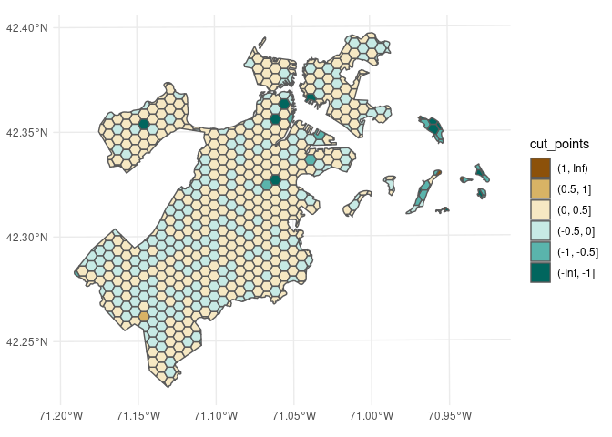

<!-- README.md is generated from README.Rmd. Please edit that file -->

# waywiser <a href="https://mikemahoney218.github.io/waywiser/"></a>

<!-- badges: start -->

[](https://github.com/mikemahoney218/waywiser/actions/workflows/R-CMD-check.yaml)
[](https://lifecycle.r-lib.org/articles/stages.html#experimental)
<!-- badges: end -->

“Waywiser” is an old-timey name for a [surveyor’s
wheel](https://en.wikipedia.org/wiki/Surveyor%27s_wheel), a device that
makes measuring long distances easier than with measurement tools like a
ruler or yardstick. The waywiser R package makes measuring model
performance on spatial data easier, extending the
[yardstick](https://yardstick.tidymodels.org/) R package to incorporate
measures of spatial autocorrelation provided by
[sfdep](https://sfdep.josiahparry.com/).

Please note that this package is highly experimental. The user-facing
API is likely to change without deprecation warnings up until the first
CRAN release.

## Example

waywiser doesn’t quite work with `fit_resamples()` yet, so this example
is more complex than it needs to be.

That said, let’s walk through how we can use waywiser to find local
indicators of spatial autocorrelation for a very simple model, looking
at how tree canopy coverage impacts temperature in Boston,
Massachusetts.

We’re going to use a bunch of packages for this process:

``` r
# waywiser itself, of course:
library(waywiser)

# For spatial cross-validation and our data set:
library(spatialsample)

# For model fitting:
library(tidymodels)
#> ── Attaching packages ───────────────────────────────── tidymodels 0.2.0.9000 ──
#> ✔ broom        0.8.0          ✔ rsample      1.0.0.9000
#> ✔ dials        1.0.0          ✔ tibble       3.1.7     
#> ✔ dplyr        1.0.9          ✔ tidyr        1.2.0     
#> ✔ infer        1.0.2          ✔ tune         0.2.0.9002
#> ✔ modeldata    0.1.1          ✔ workflows    0.2.6.9001
#> ✔ parsnip      0.2.1.9003     ✔ workflowsets 0.2.1     
#> ✔ purrr        0.3.4          ✔ yardstick    1.0.0.9000
#> ✔ recipes      0.2.0
#> ── Conflicts ───────────────────────────────────────── tidymodels_conflicts() ──
#> ✖ purrr::discard() masks scales::discard()
#> ✖ dplyr::filter()  masks stats::filter()
#> ✖ dplyr::lag()     masks stats::lag()
#> ✖ recipes::step()  masks stats::step()
#> • Learn how to get started at https://www.tidymodels.org/start/

# General data-wrangling:
library(dplyr)
library(tidyr)
library(sf)
#> Linking to GEOS 3.10.2, GDAL 3.4.3, PROJ 8.2.0; sf_use_s2() is TRUE

# Visualization:
library(ggplot2)
```

We’ll be working with the `boston_canopy` data from the spatialsample
package, fitting a linear model to associate tree canopy coverage with
mean temperature. We’ll turn on sf’s ability to download coordinate
reference systems over the internet, and then cut the data into five
different cross-validation folds based on spatial proximity:

``` r
sf_proj_network(TRUE)
#> [1] "https://cdn.proj.org"
sf_add_proj_units()

set.seed(1234)
folds <- spatial_clustering_cv(boston_canopy, v = 5)
```

Our next step is to actually fit a model to these resamples! We’re going
to use an extremely simple linear regression, fit using tools from the
tidymodels packages [workflows](https://workflows.tidymodels.org/) and
[parsnip](https://parsnip.tidymodels.org/):

``` r
model_fit <- workflow() %>% 
  add_model(linear_reg()) %>% 
  add_formula(mean_temp ~ canopy_area_2019) %>% 
  fit_resamples(folds, control = control_resamples(save_pred = TRUE))

model_fit
#> # Resampling results
#> # 5-fold spatial cross-validation 
#> # A tibble: 5 × 5
#>   splits            id    .metrics         .notes           .predictions      
#>   <list>            <chr> <list>           <list>           <list>            
#> 1 <split [600/82]>  Fold1 <tibble [2 × 4]> <tibble [0 × 3]> <tibble [82 × 4]> 
#> 2 <split [589/93]>  Fold2 <tibble [2 × 4]> <tibble [0 × 3]> <tibble [93 × 4]> 
#> 3 <split [524/158]> Fold3 <tibble [2 × 4]> <tibble [0 × 3]> <tibble [158 × 4]>
#> 4 <split [497/185]> Fold4 <tibble [2 × 4]> <tibble [0 × 3]> <tibble [185 × 4]>
#> 5 <split [518/164]> Fold5 <tibble [2 × 4]> <tibble [0 × 3]> <tibble [164 × 4]>
```

As we can see, our data contains a lot of nested tibbles. We only care
about our actual assessment-set predictions and the corresponding true
values, however. We can get rid of all the other columns and unpack the
nested columns using some tools from dplyr and tidyr:

``` r
model_predictions <- model_fit %>%
  transmute(assessment = purrr::map(splits, assessment),
            predictions = .predictions) %>% 
  unnest(cols = c(assessment, predictions), names_repair = "minimal") %>% 
  # "mean_temp" exists in both tables, so we'll get rid of the second one here:
  select(-22)

model_predictions
#> # A tibble: 682 × 22
#>    grid_id land_area canopy_gain canopy_loss canopy_no_change canopy_area_2014
#>    <chr>       <dbl>       <dbl>       <dbl>            <dbl>            <dbl>
#>  1 H-10     2691490.      73098.      80362.          345823.          426185.
#>  2 M-9      2690727.      52443.      53467.          304239.          357706.
#>  3 I-10     2691491.      77370.     129464.          434683.          564147.
#>  4 G-15      298658.      10742.      10502.          118964.          129466.
#>  5 H-13     2691492.      90971.     103740.          717828.          821569.
#>  6 G-12     2690726.     109754.      89181.          957357.         1046538.
#>  7 Q-10      156688.       9237.       3094.           57327.           60421.
#>  8 D-10      340049.      17981.       5737.          100755.          106492.
#>  9 M-10     2578879.      27026.      41240.          161115.          202355.
#> 10 J-9      2690726.      66740.      34839.          242211.          277050.
#> # … with 672 more rows, and 16 more variables: canopy_area_2019 <dbl>,
#> #   change_canopy_area <dbl>, change_canopy_percentage <dbl>,
#> #   canopy_percentage_2014 <dbl>, canopy_percentage_2019 <dbl>,
#> #   change_canopy_absolute <dbl>, mean_temp_morning <dbl>,
#> #   mean_temp_evening <dbl>, mean_temp <dbl>, mean_heat_index_morning <dbl>,
#> #   mean_heat_index_evening <dbl>, mean_heat_index <dbl>,
#> #   geometry <MULTIPOLYGON [US_survey_foot]>, .pred <dbl>, .row <int>, …
```

Alright, one last bit of set-up.

waywiser builds on top of the [sfdep](https://sfdep.josiahparry.com/)
package, itself an extension for the
[spdep](https://r-spatial.github.io/spdep/index.html) spatial dependence
library. These packages expect you to have objects representing the
neighbors of your data set and the spatial weights between observations.

As a result, right now waywiser also expects you to already have those
objects pre-created and to pass them as arguments to model metric
functions. We’ll find the neighbors in our data using the
`st_contiguity` function, and then calculate spatial weights via
`st_weights`:

``` r
nb <- st_contiguity(boston_canopy)
wt <- st_weights(nb)
```

We’re finally ready to actually use functions from waywiser to assess
our model! Let’s take a look at the local Moran’s I for each of our
hexagons, identifying local clusters and outliers to indicate areas
where our model might not be properly accounting for the spatial
structure of our data.

We can use the `ww_local_moran_i()` function to calculate the statistic
for each observation in our data:

``` r
ww_local_moran_i(
  model_predictions,
  mean_temp,
  .pred,
  nb,
  wt
)
#> # A tibble: 682 × 3
#>    .metric       .estimator .estimate
#>    <chr>         <chr>          <dbl>
#>  1 local_moran_i standard     0.0655 
#>  2 local_moran_i standard     0.155  
#>  3 local_moran_i standard    -1.24   
#>  4 local_moran_i standard     0.0869 
#>  5 local_moran_i standard     0.0147 
#>  6 local_moran_i standard     0.00799
#>  7 local_moran_i standard     0.0967 
#>  8 local_moran_i standard     0.0596 
#>  9 local_moran_i standard     0.136  
#> 10 local_moran_i standard     0.0969 
#> # … with 672 more rows
```

Or, if we want to add Moran’s I as a column to our data frame, we can
use `ww_local_moran_i_vec()` inside a call to `mutate()`:

``` r
model_predictions <- model_predictions %>% 
  mutate(local_moran_i = ww_local_moran_i_vec(mean_temp, .pred, nb, wt))

model_predictions
#> # A tibble: 682 × 23
#>    grid_id land_area canopy_gain canopy_loss canopy_no_change canopy_area_2014
#>    <chr>       <dbl>       <dbl>       <dbl>            <dbl>            <dbl>
#>  1 H-10     2691490.      73098.      80362.          345823.          426185.
#>  2 M-9      2690727.      52443.      53467.          304239.          357706.
#>  3 I-10     2691491.      77370.     129464.          434683.          564147.
#>  4 G-15      298658.      10742.      10502.          118964.          129466.
#>  5 H-13     2691492.      90971.     103740.          717828.          821569.
#>  6 G-12     2690726.     109754.      89181.          957357.         1046538.
#>  7 Q-10      156688.       9237.       3094.           57327.           60421.
#>  8 D-10      340049.      17981.       5737.          100755.          106492.
#>  9 M-10     2578879.      27026.      41240.          161115.          202355.
#> 10 J-9      2690726.      66740.      34839.          242211.          277050.
#> # … with 672 more rows, and 17 more variables: canopy_area_2019 <dbl>,
#> #   change_canopy_area <dbl>, change_canopy_percentage <dbl>,
#> #   canopy_percentage_2014 <dbl>, canopy_percentage_2019 <dbl>,
#> #   change_canopy_absolute <dbl>, mean_temp_morning <dbl>,
#> #   mean_temp_evening <dbl>, mean_temp <dbl>, mean_heat_index_morning <dbl>,
#> #   mean_heat_index_evening <dbl>, mean_heat_index <dbl>,
#> #   geometry <MULTIPOLYGON [US_survey_foot]>, .pred <dbl>, .row <int>, …
```

This makes it easier to visualize the outputs from these functions. For
instance, we can use `geom_sf()` in ggplot2 to see where our residuals
are more clustered than expected:

``` r
model_predictions |>
  mutate(
    cut_points = case_when(
      local_moran_i <= -1 ~ "(-Inf, -1]",
      local_moran_i <= -0.5 ~ "(-1, -0.5]",
      local_moran_i <= 0 ~ "(-0.5, 0]",
      local_moran_i <= 0.5 ~ "(0, 0.5]",
      local_moran_i <= 1 ~ "(0.5, 1]",
      local_moran_i > 1 ~ "(1, Inf)",
    ),
    cut_points = factor(
      cut_points,
      rev(
        c(
          "(-Inf, -1]", 
          "(-1, -0.5]", 
          "(-0.5, 0]", 
          "(0, 0.5]", 
          "(0.5, 1]", 
          "(1, Inf)")
      )
    )
  ) %>% 
  st_as_sf() %>% 
  ggplot(aes(fill = cut_points)) +
  geom_sf() + 
  scale_fill_brewer(palette = "BrBG")
```



This makes it easy to see what areas are poorly represented by our
model, which might lead us to identify ways to improve our model or help
us identify caveats and limitations of the models we’re working with.

## Installation

You can install the development version of waywiser from
[GitHub](https://github.com/) with:

``` r
# install.packages("devtools")
devtools::install_github("mikemahoney218/waywiser")
```
