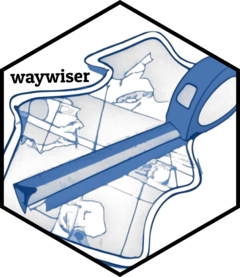
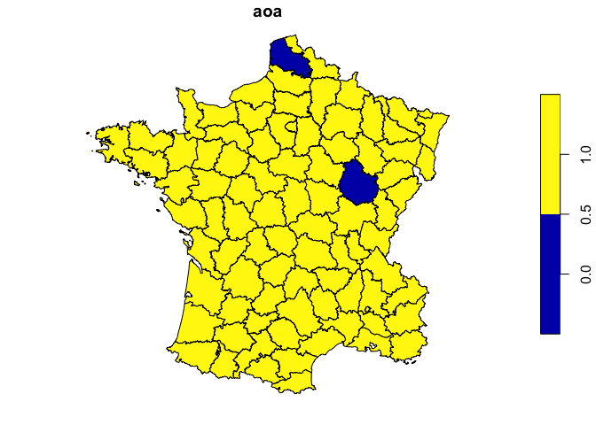

<!-- README.md is generated from README.Rmd. Please edit that file -->

# waywiser <a href="https://docs.ropensci.org/waywiser/"></a>

<!-- badges: start -->

[](https://github.com/ropensci/waywiser/actions/workflows/R-CMD-check.yaml)
[](https://choosealicense.com/licenses/mit/)
[](https://lifecycle.r-lib.org/articles/stages.html#maturing)
[](https://www.repostatus.org/#active)
[](https://app.codecov.io/gh/ropensci/waywiser?branch=main)
[](https://CRAN.R-project.org/package=waywiser)
[](https://github.com/ropensci/software-review/issues/571)
<!-- badges: end -->

“Waywiser” is an old-timey name for a [surveyor’s
wheel](https://en.wikipedia.org/wiki/Surveyor%27s_wheel), a device that
makes measuring long distances easier than with measurement tools like a
ruler or yardstick. The waywiser R package makes it easier to measure
the performance of models fit to 2D spatial data by implementing a
number of well-established assessment methods in a consistent, ergonomic
toolbox; features include new
[yardstick](https://yardstick.tidymodels.org/) metrics for measuring
agreement and spatial autocorrelation, functions to assess model
predictions across multiple scales, and methods to calculate the area of
applicability of a model.

## Installation

You can install waywiser from CRAN via:

``` r
install.packages("waywiser")
```

You can install the development version of waywiser from
[GitHub](https://github.com/) with:

``` r
# install.packages("remotes")
remotes::install_github("ropensci/waywiser")

# or, equivalently:
install.packages("waywiser", repos = "https://ropensci.r-universe.dev")
```

## Example

Let’s say that we fit a linear model predicting crimes against people as
a function of literacy, using the `guerry` data included in waywiser:

``` r
library(waywiser)

set.seed(123)
split_idx <- sample(seq_len(nrow(guerry)), nrow(guerry) * 0.8)
guerry_train <- guerry[split_idx, ]
guerry_test <- guerry[-split_idx, ]

crime_model <- lm(Crm_prs ~ Litercy, guerry_train)
```

We want to assess this model, to better understand how well it predicts
crime rates across 1830s France. One method to do so is to evaluate our
predictions at multiple levels of aggregation, as suggested by Riemann
et al. (2010) (\<doi: 10.1016/j.rse.2010.05.010\>). This approach is
focused on aggregating point predictions, so we’ll convert our data to
points and then see how well our predictions perform when aggregated to
two different scales:

``` r
guerry_points <- data.frame(
  .truth = guerry$Crm_prs,
  .estimate = predict(crime_model, guerry),
  geometry = sf::st_centroid(sf::st_geometry(guerry))
)
guerry_points <- sf::st_as_sf(guerry_points)

guerry_multi_scale <- ww_multi_scale(
  guerry_points,
  .truth,
  .estimate,
  n = list(c(5, 5), c(2, 2))
)

guerry_multi_scale
#> # A tibble: 4 × 6
#>   .metric .estimator .estimate .grid_args       .grid         .notes          
#>   <chr>   <chr>          <dbl> <list>           <list>        <list>          
#> 1 rmse    standard       4893. <tibble [1 × 1]> <sf [25 × 5]> <tibble [0 × 2]>
#> 2 mae     standard       4393. <tibble [1 × 1]> <sf [25 × 5]> <tibble [0 × 2]>
#> 3 rmse    standard       3207. <tibble [1 × 1]> <sf [4 × 5]>  <tibble [0 × 2]>
#> 4 mae     standard       3172. <tibble [1 × 1]> <sf [4 × 5]>  <tibble [0 × 2]>
```

More information about multi-scale assessment is included in
`vignette("multi-scale-assessment", package = "waywiser")`.

We could also assess the spatial dependence of our model residuals, to
identify any potential “hot spots” where our model is consistently less
accurate than we’d expect by chance:

``` r
guerry_predicted <- guerry
guerry_predicted$predictions <- predict(crime_model, guerry)

ww_local_moran_i(guerry_predicted, Crm_prs, predictions)
#> # A tibble: 85 × 3
#>    .metric       .estimator .estimate
#>    <chr>         <chr>          <dbl>
#>  1 local_moran_i standard      0.548 
#>  2 local_moran_i standard      0.943 
#>  3 local_moran_i standard      0.636 
#>  4 local_moran_i standard      0.700 
#>  5 local_moran_i standard      0.137 
#>  6 local_moran_i standard      0.917 
#>  7 local_moran_i standard      0.900 
#>  8 local_moran_i standard      1.79  
#>  9 local_moran_i standard      0.0208
#> 10 local_moran_i standard      0.750 
#> # … with 75 more rows
```

More information about multi-scale assessment is included in
`vignette("residual-autocorrelation", package = "waywiser")`.

Lastly, we can also see if there’s any areas in our data that are too
different from our training data for us to safely predict on, which fall
outside the “area of applicability” defined by Meyer and Pebesma (2021)
(\<doi: 10.1111/2041-210X.13650\>):

``` r
crime_model_aoa <- ww_area_of_applicability(
  Crm_prs ~ Litercy,
  guerry_train,
  guerry_test,
  importance = vip::vi_model(crime_model)
)
#> Warning: The AOA threshold was 0, which is usually unexpected.

guerry_aoa <- cbind(
  guerry,
  predict(crime_model_aoa, guerry)
)

plot(guerry_aoa["aoa"])
```



We can see that two areas are outside our model’s area of applicability,
meaning that we probably can’t trust our model when extrapolating into
those regions!

For more information, check out [the documentation
website!](https://docs.ropensci.org/waywiser/)

## Citing waywiser

To cite waywiser in publications please use:

> Mahoney, M. J. (2022). waywiser: Ergonomic Methods for Assessing
> Spatial Models. R package version 0.2.0,
> <https://CRAN.R-project.org/package=waywiser>.

A BibTeX entry for LaTeX users is

``` bibtex

  @Manual{,
    title = {{waywiser}: Ergonomic Methods for Assessing Spatial Models},
    author = {Michael Mahoney},
    year = 2022,
    note = {R package version 0.2.0},
    url = {https://CRAN.R-project.org/package=waywiser},
  }
```

## Contributing

Please note that this package is released with a [Contributor Code of
Conduct](https://ropensci.org/code-of-conduct/). By contributing to this
project, you agree to abide by its terms.

- If you think you have encountered a bug, please [submit an
  issue](https://github.com/ropensci/waywiser).

- Please include a
  [reprex](https://reprex.tidyverse.org/articles/articles/learn-reprex.html)
  (a minimal, reproducible example) to clearly communicate about your
  code.
