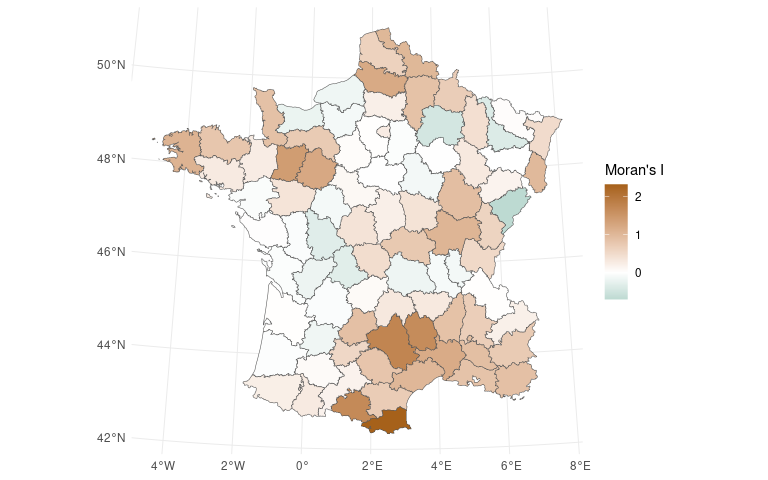

<!-- README.md is generated from README.Rmd. Please edit that file -->

# waywiser <a href="https://mikemahoney218.github.io/waywiser/"></a>

<!-- badges: start -->

[](https://github.com/mikemahoney218/waywiser/actions/workflows/R-CMD-check.yaml)
[](https://lifecycle.r-lib.org/articles/stages.html#experimental)
 [](https://app.codecov.io/gh/mikemahoney218/waywiser?branch=main)
<!-- badges: end -->

“Waywiser” is an old-timey name for a [surveyor’s
wheel](https://en.wikipedia.org/wiki/Surveyor%27s_wheel), a device that
makes measuring long distances easier than with measurement tools like a
ruler or yardstick. The waywiser R package makes measuring model
performance on spatial data easier, extending the
[yardstick](https://yardstick.tidymodels.org/) R package to incorporate
measures of spatial autocorrelation provided by
[spdep](https://cran.r-project.org/package=spdep).

## Installation

You can install waywiser from CRAN via:

``` r
install.packages("waywiser")
```

You can install the development version of waywiser from
[GitHub](https://github.com/) with:

``` r
# install.packages("devtools")
devtools::install_github("mikemahoney218/waywiser")
```

## Example

Let’s walk through how we can use waywiser to find local indicators of
spatial autocorrelation for a very simple model. First things first,
let’s load a few libraries:

``` r
# waywiser itself, of course:
library(waywiser)
# For the %>% pipe and mutate:
library(dplyr)
```

We’ll be working with the `guerry` data from the sfdep package, fitting
a linear model to associate crimes against persons with literacy. Let’s
load the data now:

``` r
data(guerry, package = "sfdep")
```

We’ll fit a simple linear model relating crimes against persons with
literacy, and then generate predictions from that model. We can use
`ww_local_moran_i()` to calculate the local spatial autocorrelation of
our residuals at each data point:

``` r
guerry %>%
  mutate(pred = predict(lm(crime_pers ~ literacy, .))) %>% 
  ww_local_moran_i(crime_pers, pred)
#> # A tibble: 85 × 4
#>    .metric       .estimator .estimate                                   geometry
#>    <chr>         <chr>          <dbl>                             <MULTIPOLYGON>
#>  1 local_moran_i standard      0.530  (((381847 1762775, 381116 1763059, 379972…
#>  2 local_moran_i standard      0.858  (((381847 1762775, 381116 1763059, 379972…
#>  3 local_moran_i standard      0.759  (((381847 1762775, 381116 1763059, 379972…
#>  4 local_moran_i standard      0.732  (((381847 1762775, 381116 1763059, 379972…
#>  5 local_moran_i standard      0.207  (((381847 1762775, 381116 1763059, 379972…
#>  6 local_moran_i standard      0.860  (((381847 1762775, 381116 1763059, 379972…
#>  7 local_moran_i standard      0.692  (((381847 1762775, 381116 1763059, 379972…
#>  8 local_moran_i standard      1.69   (((381847 1762775, 381116 1763059, 379972…
#>  9 local_moran_i standard     -0.0109 (((381847 1762775, 381116 1763059, 379972…
#> 10 local_moran_i standard      0.710  (((381847 1762775, 381116 1763059, 379972…
#> # … with 75 more rows
```

If you’re familiar with spdep, you can probably guess that waywiser is
doing *something* under the hood here to calculate which of our
observations are neighbors, and how to create spatial weights from those
neighborhoods. And that guess would be right – waywiser is making use of
two functions, `ww_build_neighbors()` and `ww_build_weights()`, in order
to automatically calculate spatial weights for calculating metrics:

``` r
ww_build_neighbors(guerry)
#> Neighbour list object:
#> Number of regions: 85 
#> Number of nonzero links: 420 
#> Percentage nonzero weights: 5.813149 
#> Average number of links: 4.941176

ww_build_weights(guerry)
#> Characteristics of weights list object:
#> Neighbour list object:
#> Number of regions: 85 
#> Number of nonzero links: 420 
#> Percentage nonzero weights: 5.813149 
#> Average number of links: 4.941176 
#> 
#> Weights style: W 
#> Weights constants summary:
#>    n   nn S0      S1       S2
#> W 85 7225 85 37.2761 347.6683
```

These functions aren’t always the best way to calculate spatial weights
for your data, however. As a result, waywiser also lets you specify your
own weights directly:

``` r
weights <- guerry %>%
  sf::st_geometry() %>%
  sf::st_centroid() %>%
  spdep::dnearneigh(0, 97000) %>%
  spdep::nb2listw()

weights
#> Characteristics of weights list object:
#> Neighbour list object:
#> Number of regions: 85 
#> Number of nonzero links: 314 
#> Percentage nonzero weights: 4.346021 
#> Average number of links: 3.694118 
#> 
#> Weights style: W 
#> Weights constants summary:
#>    n   nn S0       S1       S2
#> W 85 7225 85 51.86738 348.7071

guerry %>%
  mutate(pred = predict(lm(crime_pers ~ literacy, .))) %>% 
  ww_local_moran_i(crime_pers, pred, weights)
#> # A tibble: 85 × 4
#>    .metric       .estimator .estimate                                   geometry
#>    <chr>         <chr>          <dbl>                             <MULTIPOLYGON>
#>  1 local_moran_i standard    0.530    (((381847 1762775, 381116 1763059, 379972…
#>  2 local_moran_i standard    0.794    (((381847 1762775, 381116 1763059, 379972…
#>  3 local_moran_i standard    0.646    (((381847 1762775, 381116 1763059, 379972…
#>  4 local_moran_i standard    0.687    (((381847 1762775, 381116 1763059, 379972…
#>  5 local_moran_i standard    0.207    (((381847 1762775, 381116 1763059, 379972…
#>  6 local_moran_i standard    1.49     (((381847 1762775, 381116 1763059, 379972…
#>  7 local_moran_i standard    0.692    (((381847 1762775, 381116 1763059, 379972…
#>  8 local_moran_i standard    1.69     (((381847 1762775, 381116 1763059, 379972…
#>  9 local_moran_i standard   -0.000610 (((381847 1762775, 381116 1763059, 379972…
#> 10 local_moran_i standard    0.859    (((381847 1762775, 381116 1763059, 379972…
#> # … with 75 more rows
```

Or as a function, which lets you use custom weights with other
tidymodels functions like `fit_resamples()`:

``` r
weights_function <- function(data) {
  data %>%
    sf::st_geometry() %>%
    sf::st_centroid() %>%
    spdep::dnearneigh(0, 97000) %>%
    spdep::nb2listw()
} 

guerry %>%
  mutate(pred = predict(lm(crime_pers ~ literacy, .))) %>% 
  ww_local_moran_i(crime_pers, pred, weights_function)
#> # A tibble: 85 × 4
#>    .metric       .estimator .estimate                                   geometry
#>    <chr>         <chr>          <dbl>                             <MULTIPOLYGON>
#>  1 local_moran_i standard    0.530    (((381847 1762775, 381116 1763059, 379972…
#>  2 local_moran_i standard    0.794    (((381847 1762775, 381116 1763059, 379972…
#>  3 local_moran_i standard    0.646    (((381847 1762775, 381116 1763059, 379972…
#>  4 local_moran_i standard    0.687    (((381847 1762775, 381116 1763059, 379972…
#>  5 local_moran_i standard    0.207    (((381847 1762775, 381116 1763059, 379972…
#>  6 local_moran_i standard    1.49     (((381847 1762775, 381116 1763059, 379972…
#>  7 local_moran_i standard    0.692    (((381847 1762775, 381116 1763059, 379972…
#>  8 local_moran_i standard    1.69     (((381847 1762775, 381116 1763059, 379972…
#>  9 local_moran_i standard   -0.000610 (((381847 1762775, 381116 1763059, 379972…
#> 10 local_moran_i standard    0.859    (((381847 1762775, 381116 1763059, 379972…
#> # … with 75 more rows
```

Providing custom weights also lets us use `ww_local_moran_i_vec` to add
a column to our original data frame with our statistic, which makes
plotting using our original geometries easier:

``` r
library(ggplot2)

weights <- ww_build_weights(guerry)

guerry %>%
  mutate(pred = predict(lm(crime_pers ~ literacy, .)),
         .estimate = ww_local_moran_i_vec(crime_pers, pred, weights)) %>% 
  sf::st_as_sf() %>% 
  ggplot(aes(fill = .estimate)) +
  geom_sf() + 
  scale_fill_gradient2(
    "Moran's I", 
    low = "#018571", 
    mid = "white", 
    high = "#A6611A"
  )
```



This makes it easy to see what areas are poorly represented by our
model, which might lead us to identify ways to improve our model or help
us identify caveats and limitations of the models we’re working with.

## Contributing

This project is released with a [Contributor Code of
Conduct](https://contributor-covenant.org/version/2/1/CODE_OF_CONDUCT.html).
By contributing to this project, you agree to abide by its terms.

-   If you think you have encountered a bug, please [submit an
    issue](https://github.com/mikemahoney218/waywiser).

-   Please include a
    [reprex](https://reprex.tidyverse.org/articles/articles/learn-reprex.html)
    (a minimal, reproducible example) to clearly communicate about your
    code.
